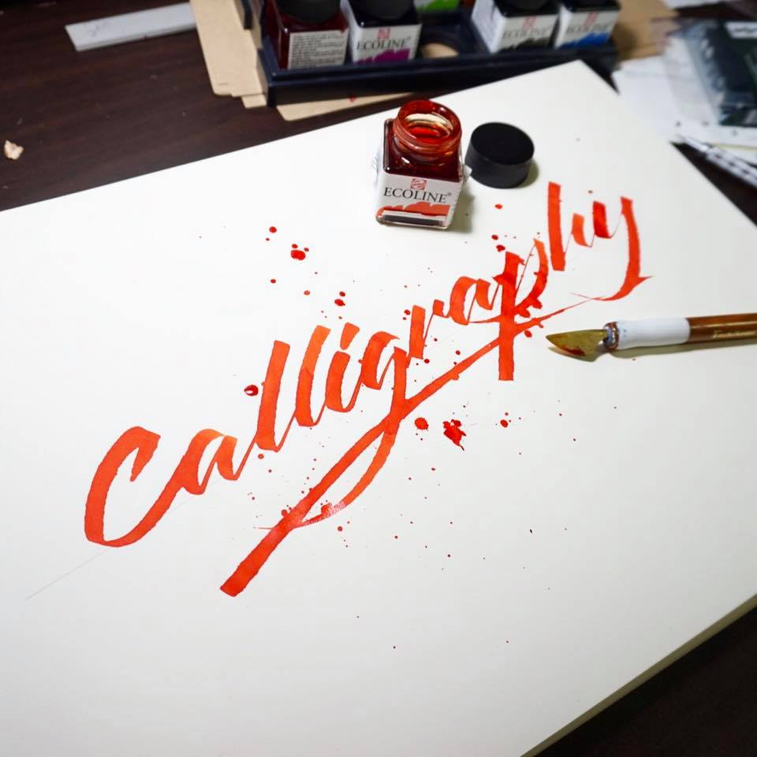
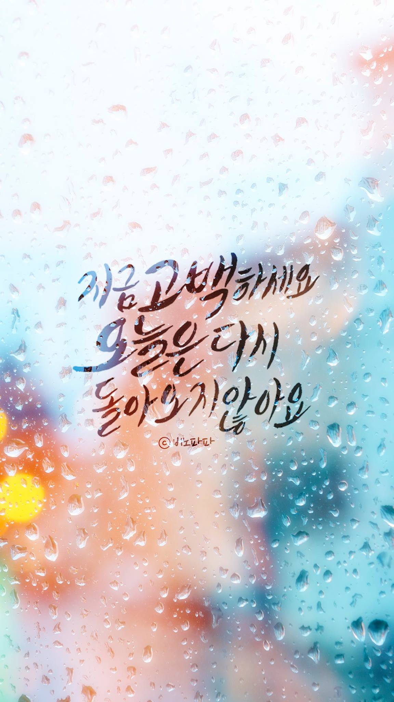

## Calligraphy란?

캘리그라피라는 단어는 그리스어로 "아름답다"는 뜻의 칼로스(kallos)와 "쓰다"는 뜻의 그라프(graph)에서 비롯되었습니다. 우리는 글자를 아름답게 쓸 때 행복을 느끼곤 합니다. 종이 위에서 펜촉이 사각거리는 소리를 들으며 글자를 그리고 꾸미는 일은 즐겁기까지 합니다.

시대가 변함에 따라 이러한 글자를 손으로 적고 꾸미는 사람들이 적어지고 있습니다. 그렇기 때문에 디지털 세상 속에서 아날로그적 감성이 담겨있는 캘리그라피는 더욱 더 매력적으로 느껴지기도 합니다. 

실제로 작품들을 보다보면, 컴퓨터로 찍어낸 듯이 정교한 글씨도 볼 수 있는 반면, 작가의 개성이 드러나 있는 글씨들도 많이 볼 수 있습니다. 캘리그라피를 처음 시작하시는 분이라면, 하나의 서체에 대해서 연구하고, 쓸 수 있도록 연습한 후에 개성을 조금씩 섞어서 연습하는 것이 가장 좋은 방법일 것 같습니다.

[이전](README.md "before")
