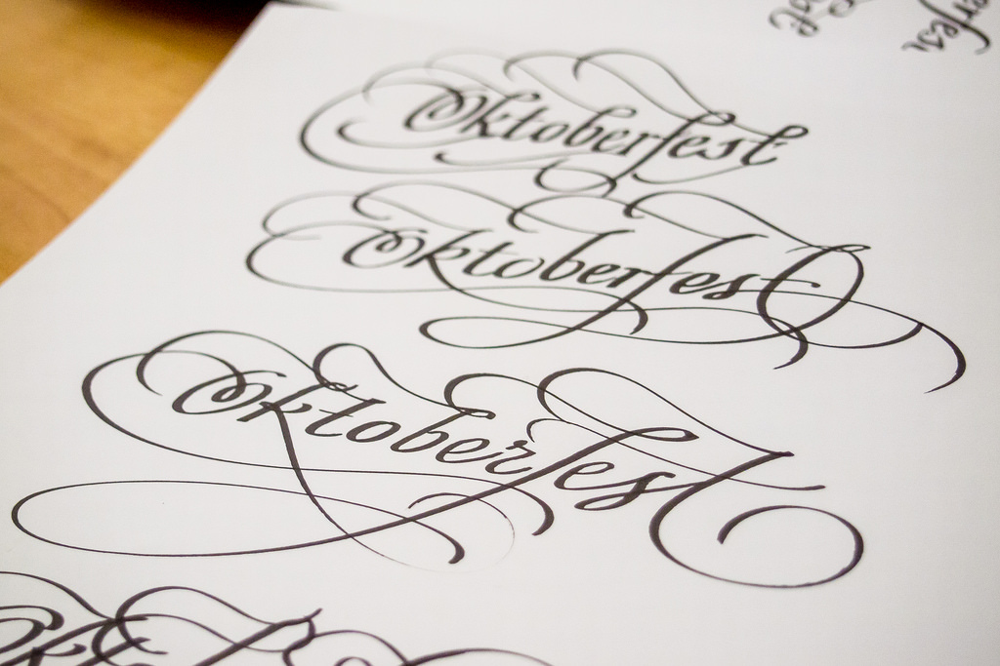

## 플러리싱(Flourishing)

플러리싱 기법은 영문서체(원래는 영문에만 있는 기법이지만, 여러 작가들이 한글에 접목시키는 것을 시도하고 있습니다.)에 이용할 수 있는 기법입니다. 의도적으로 획을 길게 끌어서 아름답게 보이는 것을 목적으로 합니다.

카퍼플레이트체와 매우 잘 어울리는 기법입니다. 단순히 획을 늘리기만 하는 플러리싱도 있지만, 늘려서 풀같은 그림을 그리는 플러리싱 기법도 있습니다. 플러리싱의 경우 몇가지 권고하는 사항이 있습니다.

1. 빈 부분을 플러리싱으로 채울 것
2. 굵은 부분이 겹치지 않도록 획을 그을 것

이 기법은 연습이 정말 많이 필요합니다. 같은 글씨라도 플러리싱에 따라서 느낌이 많이 달라지기 때문에, 여러 작품을 보고 따라하고, 창작하는 것이 플러리싱을 잘 하는 유일한 방법입니다.

[이전](Fonts.md "before")
