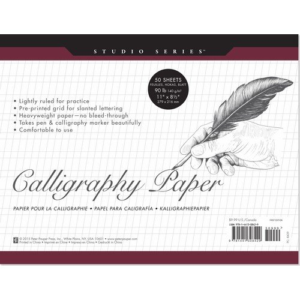
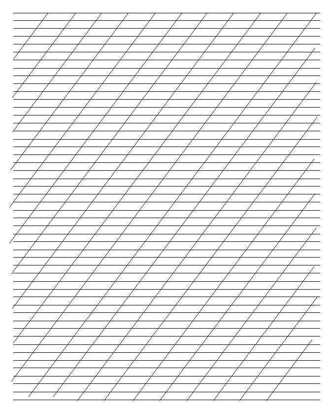

## 종이

캘리그라피용 종이는 잉크가 닿았을 때 번지지 않는지를 확인하는 것이 가장 중요합니다. 번짐의 정도는 일반적으로 종이 두께에 의해 결정되므로 두께를 확인하여 종이를 선택하는 것이 좋습니다.

또 하나 살펴봐야 할 것은 종이의 질감입니다. 종이 표면이 너무 매끄러우면 필기구가 미끄러져서 속도를 조절하기가 힘들고, 반대로 표면이 거칠면 펜촉의 경우 자연스러운 흐름을 막기 때문에 주의해야 합니다. 캘리그라피 연습을 할 때는 마커지나 복사용지를 사용하는 것이 좋으며, 작품용으로는 수채화지나 화선지가 적당합니다.

### 작품용 종이
---

작품용으로 사용되는 수채화지는 잉크가 쉽게 번지지 않으며, 연필로 한 스케치를 지우개로 지울 때에도 종이가 일어나거나 쉽게 찢어지지 않습니다. 중요한 것은 종이의 두께입니다. 종이가 얇으면 물칠을 많이 할수록 가장자리가 말리고 주름이 생기기 쉽기 때문입니다. 두께는 *g/m²*수로 확인할 수 있으며, 일반 작품용으로는 보통 200~300*g/m²* 정도의 두께가 알맞습니다. 캘리그라피용으로 흔히 사용하는 수채화지는 종이의 입자가 거의 보이지 않을 정도로 고운 세목이기 때문에 가는 펜촉을 사용해도 글씨를 부드럽게 쓸 수 있습니다. 세목보다 낮은 온도에서 압축하여 만든 중목은 종이의 결이 남아 있어 표면에 울퉁불퉁한 질감이 느껴지므로 거친 느낌을 표현하는 데 유리합니다.

수채화지의 일종인 화선지는 물을 흡수하는 능력이 탁월하여 그림이나 글씨를 일부러 번지도록 할 때 쓰면 좋은 종이입니다. 붓으로 쓸 때에는 붓 끝이 갈라지면서 나타나는 갈필 효과를 표현하기 좋습니다.

시중에서 파는 화선지는 대부분 연습용이라 구김이 심합니다. 따라서 선물용으로 글씨를 쓰고 싶다면 화선지보다 더 두꺼운 이합지를 구입하는 편이 낫습니다. 화선지에 글씨를 쓸 때에는 아래로 스며든 먹물이나 잉크가 흡수되도록 책상 위에 천을 깔고 종이를 올려야 합니다. 종이를 구김 없이 잘 펴고 고정하기 위해서는 문진을 준비해야 하는데, 문진이 없을 경우 무거운 물건으로 눌러주면 됩니다.

### 연습용 종이
---

연습용으로는 글씨가 번지지 않으면서도 얇은 종이를 선택해야 합니다. 특히 영문 캘리그라피의 경우, 두께가 100*g/m²* 이하인 종이를 선택해야 가이드 위에 깔고 써도 선이 비쳐 보이기 때문에 글씨 연습을 하기 쉽습니다.

사무용 복사용지는 가장 저렴하게 구입할 수 있는 연습용지입니다. 연습용 가이드를 바로 출력해서 사용할 수도 있습니다. 하지만 잉크로 복사용지 위에 글씨를 쓸 때에는 그 두께를 미리 확인해야 합니다. 최소 85*g/m²*이상이어야 잉크가 번지지 않습니다. 붓으로 연습하는 경우에는 복사용지가 화선지에 비해 흡수성이 떨어지므로 번지는 효과를 기대하기는 어렵습니다. 대신 용지의 표면이 매끄럽기 때문에 획이 잘 나오는 편입니다.

#### 가이드란?
영문 캘리그라피는 펜촉의 너비에 따라 각 서체마다 정해진 높이가 있기 때문에 그에 맞춰 연습을 해야 합니다. 따라서 펜촉을 이용하여 가이드를 만들어 글씨를 쓰는데, 매번 만들어 쓰기가 번거롭기 때문에 비치는 종이 밑에 가이드를 깔고 연습하는 게 일반적입니다.

[이전](Preparation.md "before")